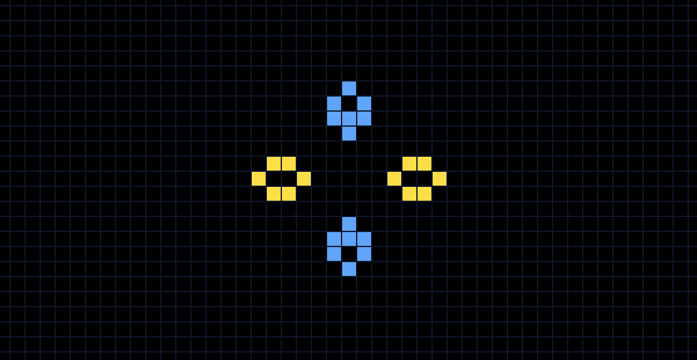

# Game of Tribes

This project was generated with [Angular CLI](https://github.com/angular/angular-cli) version 14.2.6.

## John Conway's 'Game of Life'

Game of Tribes follows the rules of John Conway's [*Game of Life*](https://en.wikipedia.org/wiki/Conway%27s_Game_of_Life):

* If a cell is dead
    1. It comes alive it has 3 live neighbors, due to reproduction
    1. Else, it remains dead
* If a cell is alive
    1. It stays alive if it has 2 or 3 live neighbors
    1. It dies if it has 1 live neighbor, due to underpopulation
    1. It dies if it has 4 or more live neighbors, due to overpopulation
* Each cell (unless on the edge of the graph) has 8 neighbors, including diagonals

## Game of Tribes Rules

The above rules hold true in Game of Tribes. However, a live cell can belong to one of two tribes (yellow or blue).

Additional rules are as follows:

* A dead cell comes alive if it has 3 live neighbors with the tribe of the majority of its neighbors
* A live cell dies if doesn't have exactly 2 or 3 live neighbors
* A live cell remains the same tribe if it has two live neighbors of differing tribe
* A live cell with two live neighbors of the same tribe will belong to that tribe regardless of its initial tribe
* A live cell with three live neighbors will belong to the tribe of the majority of its neighbors

## Development server

Run `ng serve` for a dev server. Navigate to `http://localhost:4200/`. The application will automatically reload if you change any of the source files.

## Code scaffolding

Run `ng generate component component-name` to generate a new component. You can also use `ng generate directive|pipe|service|class|guard|interface|enum|module`.

## Build

Run `ng build` to build the project. The build artifacts will be stored in the `dist/` directory.

## Running unit tests

Run `ng test` to execute the unit tests via [Karma](https://karma-runner.github.io).

## Running end-to-end tests

Run `ng e2e` to execute the end-to-end tests via a platform of your choice. To use this command, you need to first add a package that implements end-to-end testing capabilities.

## Further help

To get more help on the Angular CLI use `ng help` or go check out the [Angular CLI Overview and Command Reference](https://angular.io/cli) page.
